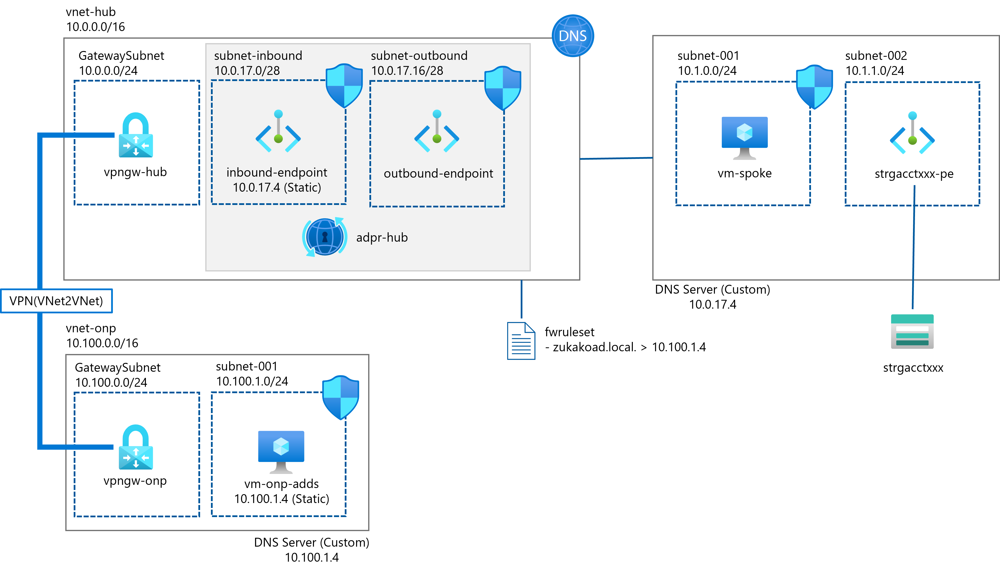

# Azure DNS Private Resolver Quick Starter
This repository can be used for PoC of Azure DNS Private Resolver. It includes the bicep file named `main.bicep`, deploys the minimum components for validating cross-premise domain name resolution.

## Architecture
The overall architecture is like bellow. As an alternative to onpremise network, it uses Virtual Network(`vnet-onp`) connected to Virtual Network with VNet2VNet VPN. For security reasons, this bicep doesn't deploy Public IPs and NSG rules to RDP for Virtual Machines, so please change ip configurations of nic(for having Public IP) and NSG rules after deployment.

It also doesn't contain the auto configuration of Active Directory Domain Service/DNS on Windows OS, so you have to do it to complete the architecture. You can find some references by searching in Bing, like [this](https://zenn.dev/microsoft/articles/1e7c9bcaff8875), please try with any of them.



## Deployment
As usually, first create the resource group for this deployment.
```bash
$ az group create --name MyResourceGroup --location japaneast
```
Deploy main.bicep options:

- With parameter file

```
$ az deployment group create --resource-group MyResourceGroup --template-file main.bicep --parameters params.json
```

- Without parameter file

This option, you have to fill the parameters in the prompt.

```
$ az deployment group create --resource-group MyResourceGroup --template-file main.bicep

vmAdminPassword: xxxx
```

As you can see in source code, in this deployment, two Virtual Machines has the same account name and password.

# Validation
To validate it does actually work, try the bidirectional domain name resolution.
- From `vm-onp-adds`, check you would be able to resolve the private endpoint of storage account.
```
C:\Users\AzureAdmin>nslookup strgacct67y6xprrpw5cw.blob.core.windows.net
Server:  UnKnown
Address:  ::1

Non-authoritative answer:
Name:    strgacct67y6xprrpw5cw.privatelink.blob.core.windows.net
Address:  10.1.1.4
Aliases:  strgacct67y6xprrpw5cw.blob.core.windows.net

```
- From `vm-spoke`, check you would be able to resolve the hostname in local domain, `vm-onp-adds.zukakoad.local`.
```
C:\Users\AzureAdmin>nslookup vm-onp-adds.zukakoad.local
Server:  UnKnown
Address:  10.0.17.4

Non-authoritative answer:
Name:    vm-onp-adds.zukakoad.local
Address:  10.100.1.4
```
- From `vm-spoke`, check you would be able to resolve the private endpoint of storage account.
```
C:\Users\AzureAdmin>nslookup strgacct67y6xprrpw5cw.blob.core.windows.net
Server:  UnKnown
Address:  10.0.17.4

Non-authoritative answer:
Name:    strgacct67y6xprrpw5cw.privatelink.blob.core.windows.net
Address:  10.1.1.4
Aliases:  strgacct67y6xprrpw5cw.blob.core.windows.net
```

# Lisence
This project is licensed under the MIT License, see the LICENSE.txt file for details.
